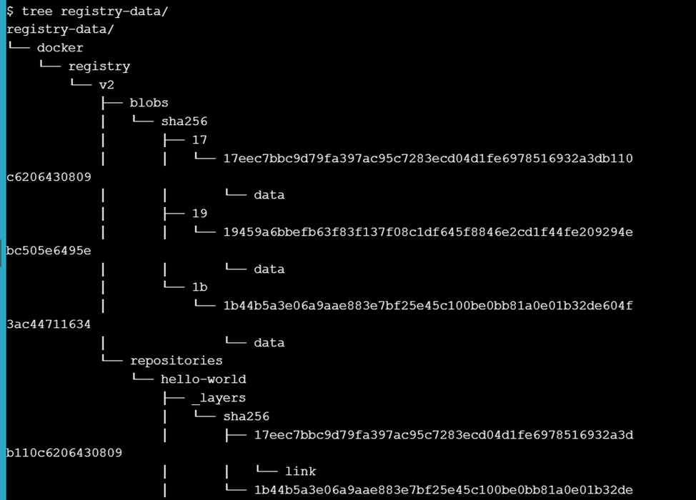
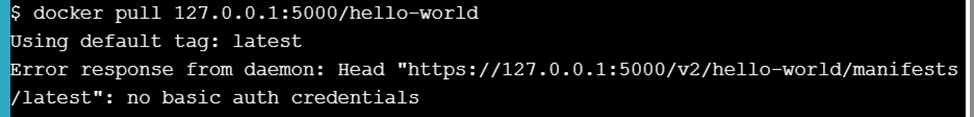
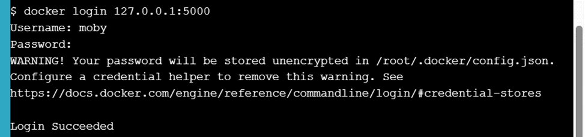
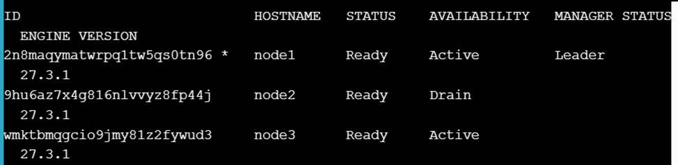
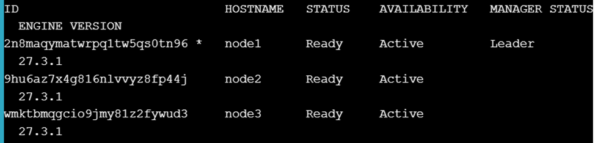
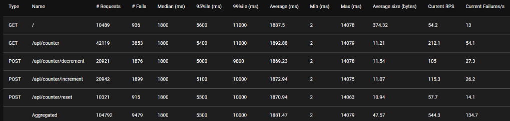
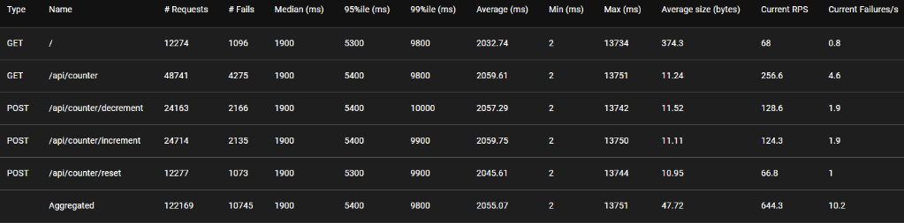
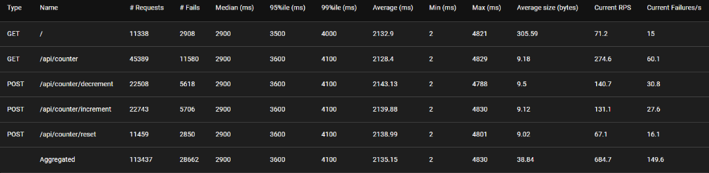

# Задание 6. Масштабирование приложений
**Выполнил студент группы P4207 Князев Илья.**

**Ссылка на репозиторий: https://github.com/EXEamp1e/task6**

## Ход работы
1. Docker registry for Linux Part 1:


2. Docker registry for Linux Parts 2 & 3:


3. Docker Orchestration Hands-on Lab:



Работа запущенного сервиса на этом узле не восстановилась, так как после перевода узла в Drain все контейнеры с него перезапускаются на других доступных узлах.
Что необходимо сделать, чтобы запустить работу службы на этом узле снова?

Чтобы задачи сервиса снова могли быть запланированы на node2, потребуется инициировать изменение в сервисе, которое заставит Swarm перераспределить реплики. Например, увеличить, а затем уменьшить количество реплик сервиса
4. Swarm stack introduction:

Количество экземпляров каждого сервиса (реплик) в развертываемом стеке настраивается декларативно в файле docker-stack.yml. 
Проверка жизнеспособности настраивается в секции deploy с помощью блока healthcheck:
```yaml
result:
  image: dockersamples/examplevotingapp_result:before
  depends_on:
    - db
  deploy:
    replicas: 2
    restart_policy:
      condition: on-failure
    healthcheck:
      test: ["CMD", "curl", "-f", "http://localhost"]
      interval: 5s     
      timeout: 3s     
      retries: 3      
      start_period: 10s
```

5. Репозиторий со счетчиком:

Изначальные результаты нагрузочного тестирования:


Результаты после увеличения истансов до 4:


Можем увидеть увеличение RPS на 13-14%

Результаты с k8s:

Можем увидеть увеличение RPS на 6-8% в сравнении со Swarm